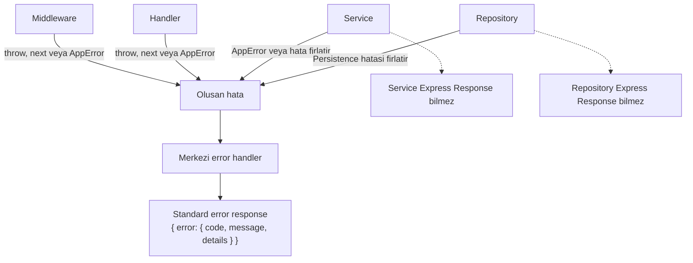
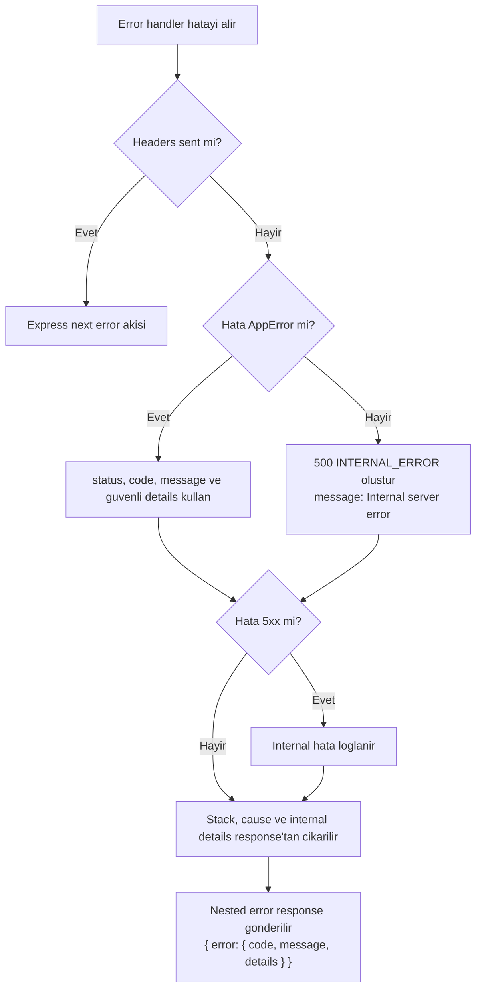
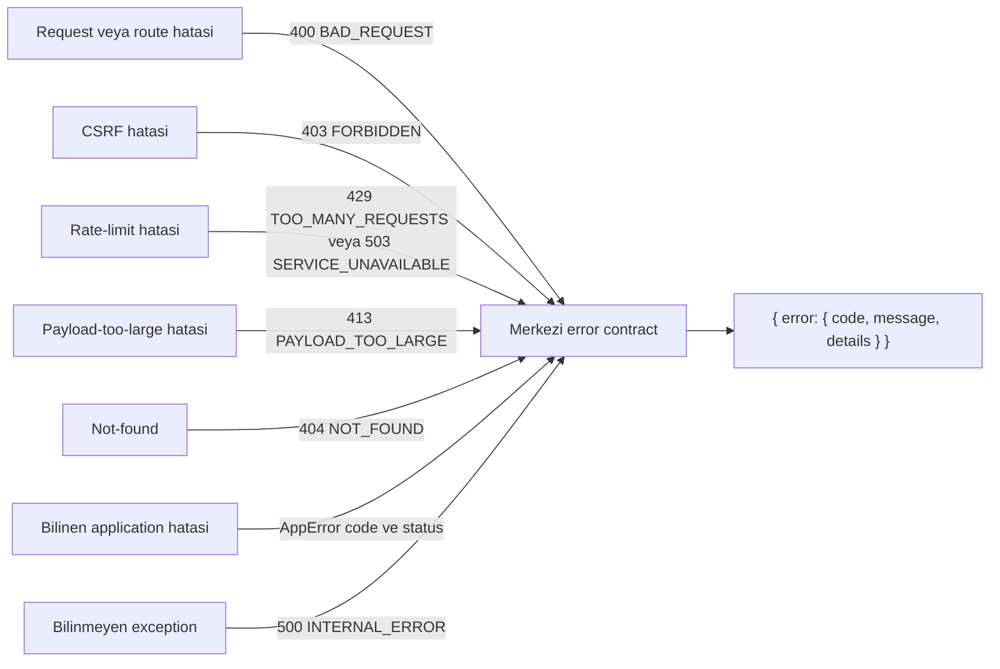

# Error Contract Flow

Bu dosya Error Contract fazinda uygulanacak merkezi hata akisini Mermaid diyagramlariyla gosterir. Diyagramlar implementation contract seviyesindedir; diger roadmap fazlarini kapsama dahil etmez.

## Diyagram 1: Hatanın Oluşması ve Merkezi İşlenmesi

### Amaç

Middleware, handler, service veya repository katmanindan cikan hatalarin tek merkezi error handler tarafindan standard response'a cevrilmesini gosterir.

### Kaynak Kararlar

- Service katmani Express `Response` bilmez; hata gerekiyorsa `AppError` firlatir.
- Handler/middleware katmani dogrudan custom JSON error yazmak yerine helper veya `AppError` kullanir.
- Tum hata cevaplari `{ error: { code, message, details } }` seklinde doner.

### Değişmez Kurallar

- Service ve repository Express response olusturmaz.
- Hata response shape'i middleware'e gore degismez.
- Success response'lara bu fazda zorunlu wrapper eklenmez.

### Acceptance Criteria

- Not-found, CSRF, rate-limit, payload-too-large ve unknown exception ayni nested contract'i kullanir.
- Handler/service kaynakli bilinen hatalar `AppError` veya kaynak planla uyumlu factory modeli ile merkezi handler'a akar.

## Diyagram 2: AppError ve Bilinmeyen Hata Ayrımı

### Amaç

Bilinen application hatalari ile bilinmeyen exception'larin nasil ayrildigini ve response body'ye yalnizca guvenli alanlarin yazilacagini gosterir.

### Kaynak Kararlar

- `errorHandler`, `AppError` hatalarini status/code/message/details ile standart response'a map eder.
- Bilinmeyen hatalar her zaman 500 `INTERNAL_ERROR` olarak doner.
- `details` sadece client'a gosterilmesi guvenli, JSON-serializable veri tasir.
- `cause`, stack veya internal DB hata detayi response body'ye yazilmaz.
- 500 hatalarda public message sabit kalir: `Internal server error`.

### Değişmez Kurallar

- AppError olmayan internal hata client'a raw message, stack, cause veya DB detayi dondurmez.
- `details` alani guvenli degilse bos obje olarak donmelidir.
- Headers zaten gonderilmisse Express'in mevcut error akisi korunur.

### Acceptance Criteria

- Bilinmeyen async route exception'i `500 INTERNAL_ERROR` nested contract ile doner.
- 500 response body icinde `stack`, `cause`, SQL mesaji veya internal DB detayi bulunmaz.
- Bilinen `AppError` status, code, message ve guvenli details ile doner.

## Diyagram 3: HTTP Hata Kaynakları

### Amaç

Mevcut projede farkli yerlerden uretilen hata kaynaklarinin tek response contract'a baglanmasini gosterir.

### Kaynak Kararlar

- `error.middleware.ts`, `not-found.middleware.ts`, `csrf.ts`, `rate-limit.ts` merkezi helper'i kullanmalidir.
- 400, 403, 404, 413, 429 ve 500 durumlari test edilmelidir.
- Bilinmeyen hatalar `INTERNAL_ERROR` olarak donmelidir.

### Değişmez Kurallar

- CSRF ve rate-limit kendi ozel flat JSON formatlarini uretmez.
- Payload parser internal detayi response body'ye yazilmaz.
- CORS config veya allowlist modeli bu diyagram kapsaminda degistirilmez.

### Acceptance Criteria

- Eski flat `{ error, message, details }` shape'i error kaynaklarindan donmez.
- Tum listelenen hata kaynaklari nested `{ error: { code, message, details } }` contract'i kullanir.
- 429 ve 503 rate-limit davranisinda status korunurken response shape standartlasir.
