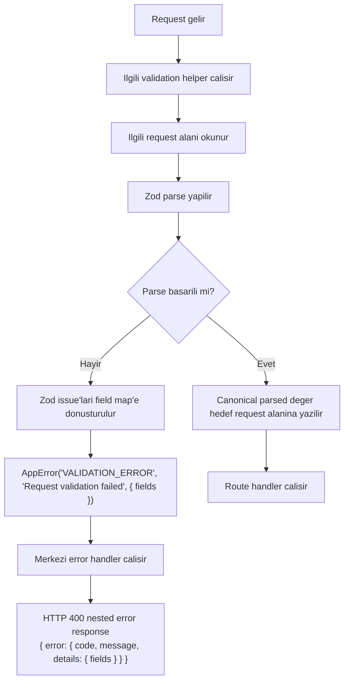
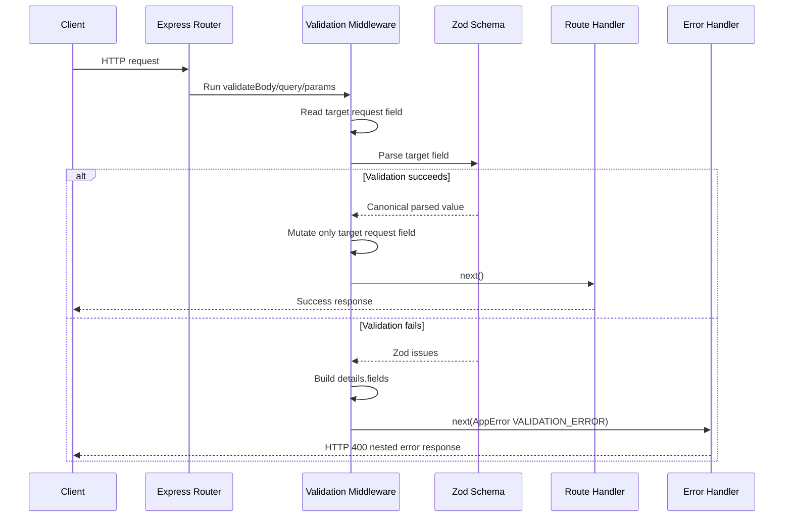

# Request Validation Flow

Bu dosya Request Validation fazinda uygulanacak body, query ve params validation akisini implementation contract seviyesinde tarif eder. Diyagramlar Error Contract fazinin tamamlanmis oldugunu kabul eder ve Authorization veya sonraki roadmap fazlarini kapsamaz.

## Diyagram 1: Genel validation akışı



### Amaç

Her request validation helper'inin ayni temel algoritmayi kullanmasini saglamak: oku, Zod ile parse et, basarisizsa Error Contract'a uygun `VALIDATION_ERROR` uret, basariliysa canonical degeri request alanina yaz ve handler'a devam et.

### Kaynak kararlar

- Zod, API request validation icin standarttir.
- Validation hatalari HTTP 400 ve `VALIDATION_ERROR` olarak doner.
- Error response tamamlanmis nested Error Contract yapisini kullanir.
- Field-level hata detaylari `error.details.fields` altinda doner.
- Basarili parse sonrasi request alani canonical Zod output'u ile degistirilir.

### Değişmez kurallar

- Basarisiz parse sonrasi request alani degistirilmez.
- Basarisiz parse sonrasi route handler calismaz.
- Helper dogrudan JSON response yazmaz.
- Parsed veri `res.locals` altinda tasinmaz.
- Raw request body saklanmaz.

### Acceptance criteria

- AC-1, AC-3, AC-5: Basarili body/query/params parse sonrasi handler canonical degeri gorur.
- AC-2, AC-4, AC-6: Gecersiz body/query/params HTTP 400 `VALIDATION_ERROR` dondurur.
- AC-7: Field-level hatalar `error.details.fields` altindadir.
- AC-8, AC-9: Validation basarisizliginda handler calismaz ve request alani degismez.
- AC-11: Response mevcut nested Error Contract ile uyumludur.

## Diyagram 2: Body/query/params ayrımı

```mermaid
flowchart LR
  BODY[validateBody(schema)]
  QUERY[validateQuery(schema)]
  PARAMS[validateParams(schema)]

  BODYREAD[Okur: req.body]
  QUERYREAD[Okur: req.query]
  PARAMSREAD[Okur: req.params]

  COMMON[Ortak Zod parse ve error mapping]

  BODYWRITE[Yazar: req.body]
  QUERYWRITE[Yazar: req.query canonical gorunumu]
  PARAMSWRITE[Yazar: req.params]

  BODYHANDLER[Handler canonical body gorur]
  QUERYHANDLER[Handler canonical query gorur]
  PARAMSHANDLER[Handler canonical params gorur]

  ERR["Basarisiz parse<br/>AppError VALIDATION_ERROR<br/>details.fields"]

  BODY --> BODYREAD --> COMMON
  QUERY --> QUERYREAD --> COMMON
  PARAMS --> PARAMSREAD --> COMMON

  COMMON -- "Parse basarili body" --> BODYWRITE --> BODYHANDLER
  COMMON -- "Parse basarili query" --> QUERYWRITE --> QUERYHANDLER
  COMMON -- "Parse basarili params" --> PARAMSWRITE --> PARAMSHANDLER
  COMMON -- "Parse basarisiz" --> ERR
```

### Amaç

Uc helper arasindaki tek farkin hedef request alani oldugunu, parse/error mapping davranisinin ortak kalacagini gosterir.

### Kaynak kararlar

- `validateBody(schema)`, `validateQuery(schema)` ve `validateParams(schema)` helper/middleware'lari olusturulacaktir.
- Basarili parse sonrasi sadece ilgili request alani canonical degerle degistirilir.
- Parsed request verisi `res.locals` altinda tasinmaz.
- Handler raw input yerine validate, normalize veya coerce edilmis veriyle calisir.

### Değişmez kurallar

- `validateBody` query veya params alanina dokunmaz.
- `validateQuery` body veya params alanina dokunmaz.
- `validateParams` body veya query alanina dokunmaz.
- Her helper ayni `VALIDATION_ERROR` mapping standardini kullanir.
- Express 5 `req.query` getter kısıtı implementasyonda dikkate alinir ve testle dogrulanir.

### Acceptance criteria

- AC-1: Body helper canonical body degerini handler'a tasir.
- AC-3: Query helper coercion sonrasi canonical query degerini handler'a tasir.
- AC-5: Params helper canonical params degerini handler'a tasir.
- AC-10: Validation basarili oldugunda yalnizca hedef request alani degisir.

## Diyagram 3: Request validation sequence



### Amaç

Express middleware zincirinde validation'in route handler'dan once calistigini ve basarisiz durumda merkezi error handler'a devrederek normal handler'i atladigini gosterir.

### Kaynak kararlar

- Validation helper'lari handler'dan once middleware olarak kullanilir.
- Validation hatalari `VALIDATION_ERROR` koduyla 400 doner.
- Merkezi error middleware nested Error Contract response'unu uretir.
- Basarili parse sonrasi handler canonical parsed degeri gorur.

### Değişmez kurallar

- Basarisiz validation'da success handler response'u uretilmez.
- Validation middleware Error Contract'i bypass etmez.
- Request mutation sadece parse basarisindan sonra yapilir.
- Domain is kurali veya authorization kontrolu validation middleware'e eklenmez.

### Acceptance criteria

- AC-2, AC-4, AC-6: Validation fail branch'i HTTP 400 `VALIDATION_ERROR` uretir.
- AC-8: Fail branch'inde route handler calismaz.
- AC-9: Fail branch'inde request alani degismez.
- AC-11: Error handler nested contract response'u uretir.
- AC-12: Typecheck, test ve ilgili Biome kontrolleri temizdir.
