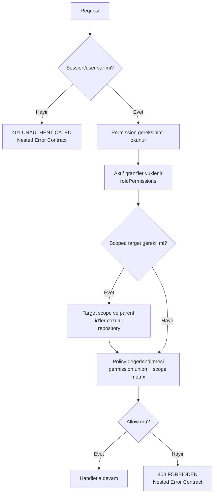
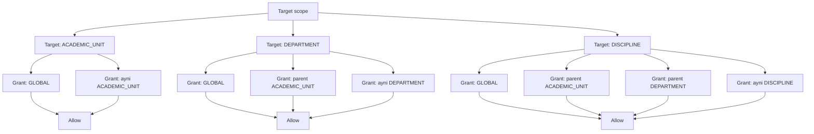
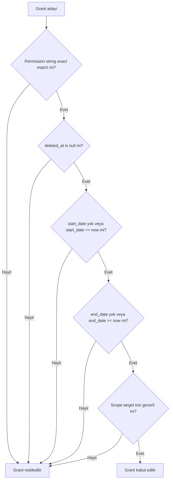

# Authorization Scope and Policy Flow

## Diyagram 1: Genel authorization kararı

### Amaç

Authentication kontrolu ile authorization kararinin ayrildigini ve tum deny akisinin merkezi Error Contract ile dondugunu gosterir.

### Kaynak kararlar

- Session/user yoksa `UNAUTHENTICATED` 401.
- Kullanici var ama grant yoksa `FORBIDDEN` 403.
- Aktif permission kayitlari union olarak degerlendirilir.
- Parent scope id'leri repository uzerinden cozulur.

### Değişmez kurallar

- Middleware dogrudan custom JSON error yazmaz.
- Policy DB bilmez.
- Kysely yalnizca repository katmaninda kullanilir.
- Handler deny durumunda calismaz.

### Acceptance criteria

- AC-1, AC-2, AC-15, AC-16, AC-17.

## Diyagram 2: Scope inheritance

### Amaç

Kesin effective grant matrisini target scope turlerine gore gorsellestirir.

### Kaynak kararlar

- `GLOBAL` grant tum hedeflerde gecerlidir.
- `ACADEMIC_UNIT` grant ayni ust akademik birim ve onun altindaki department/discipline hedeflerinde gecerlidir.
- `DEPARTMENT` grant ayni department ve onun altindaki discipline hedeflerinde gecerlidir.
- `DISCIPLINE` grant yalnizca ayni discipline hedefinde gecerlidir.

### Değişmez kurallar

- Parent scope inheritance bu matris disina cikmaz.
- Deny veya negative permission yoktur.
- Ileride `exactScopeOnly` eklenirse explicit opsiyon olmalidir.

### Acceptance criteria

- AC-4, AC-5, AC-6, AC-7, AC-8, AC-9.

## Diyagram 3: Grant validity

### Amaç

Bir `rolePermissions` satirinin authorization kararinda dikkate alinmasi icin gecmesi gereken filtreleri gosterir.

### Kaynak kararlar

- Permission string exact match kullanilir.
- Silinmis permission kayitlari dikkate alinmaz.
- `start_date` ve `end_date` varsa gecerlilik kontrolu yapilir.
- Scope inheritance kesin matrise gore uygulanir.

### Değişmez kurallar

- Soft-deleted veya tarih disi kayit policy sonucunu allow'a ceviremez.
- Permission wildcard veya role-name hardcode yoktur.
- Aktif grant'ler union olarak degerlendirilir.

### Acceptance criteria

- AC-10, AC-11, AC-12, AC-13, AC-14.
