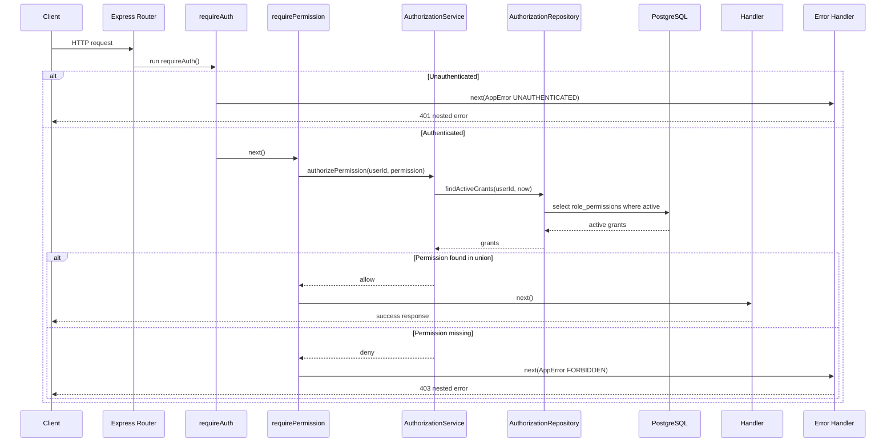
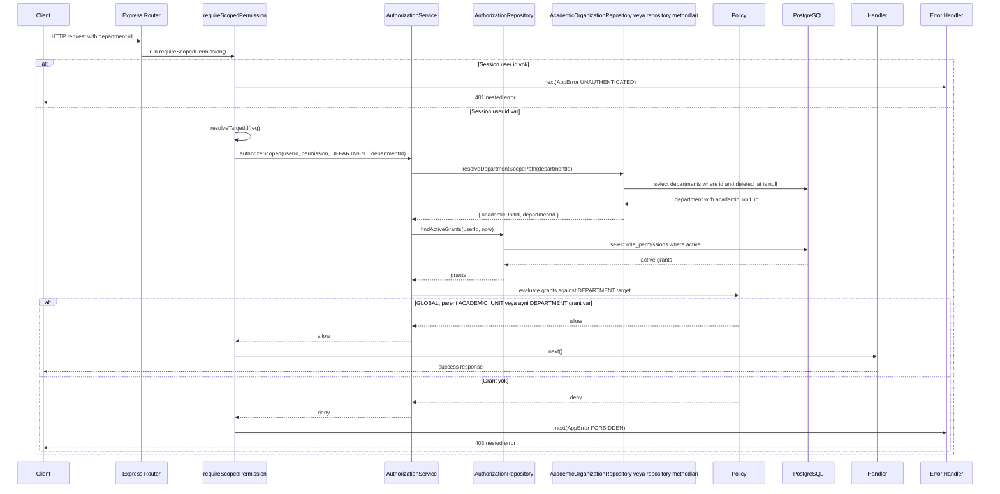

# Authorization Sequence Diagrams

## Sequence 1: Global permission

### Notlar

- `requireAuth` authentication kararini verir; permission sorgusu yapmaz.
- `requirePermission` scope gerektirmeyen permission kontrolu icindir.
- `rolePermissions.permissions` array'leri union olarak degerlendirilir.
- Repository `deletedAt`, `startDate`, `endDate` filtrelerini uygular.

## Sequence 2: Department scoped permission

### Akış

1. Session user id alinir.
2. Department target id `resolveTargetId(req)` ile cozulur.
3. Parent academic unit id repository uzerinden `departments.academicUnitId` kolonundan bulunur.
4. Aktif grant'ler okunur.
5. Policy `GLOBAL`, parent `ACADEMIC_UNIT` veya ayni `DEPARTMENT` grant kontrolu yapar.
6. Allow ise handler calisir.
7. Deny ise 403 doner.

### Target bulunamama notu (Resolved)

Target bulunamaz veya soft-deleted ise authorization middleware handler'i calistirmadan `FORBIDDEN` 403 doner. "Yok" ve "var ama yetkisiz" ayni 403 ile donerek varlik bilgisini sizdirmaz (enumeration oracle engellenir). Resource existence contract'i gerekiyorsa authz gectikten sonra domain handler/service seviyesinde ele alinir.
